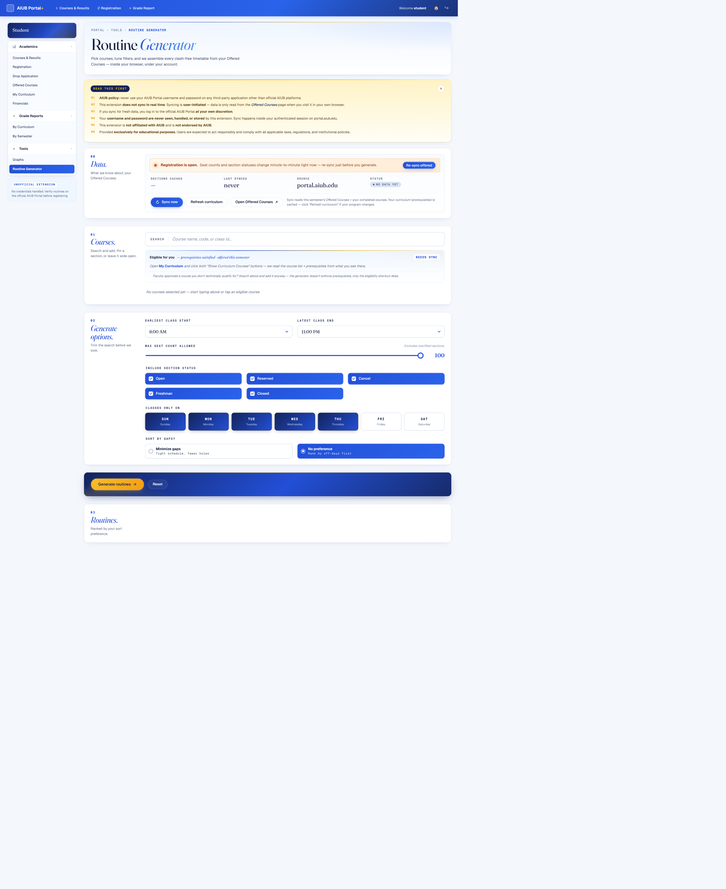
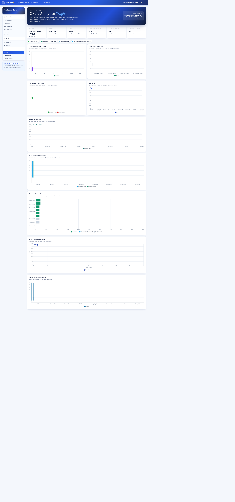
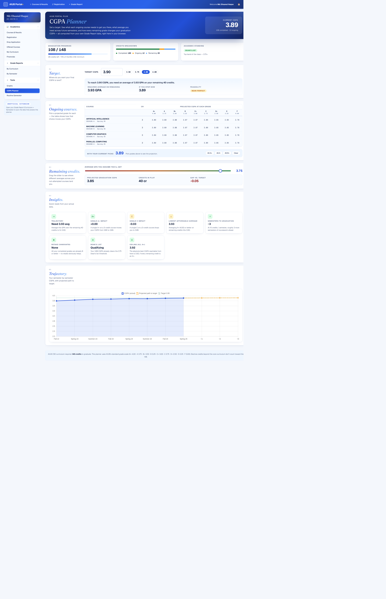
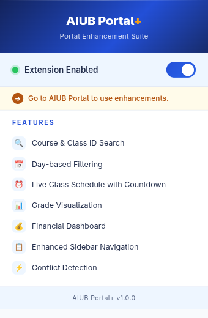

# AIUB Portal+

A browser extension that turns the AIUB Student Portal into a modern, fast, and useful workspace — without touching your credentials, without syncing anything to a server, and without leaving the official `portal.aiub.edu` session you already trust.

Built for students who spend real time in the portal: registering for courses, hunting clash-free routines, checking grades, planning semesters.

---

## Features

### Routine Generator
Pick the courses you want, set filters (earliest start, latest end, seat cap, allowed days, included statuses, gap preference), and the extension builds **every clash-free timetable** from this semester's Offered Courses — inside your own browser, under your own session. No credentials, no server.

- Course/code/class-ID search with eligibility shortcut (prerequisites satisfied + offered this semester)
- Pin specific sections or leave wide open
- "Sort by gaps" / "rank by off-days" modes
- Paginated results — load more in batches of five
- Registration-open banner that warns when cached data might go stale



### Grade Analytics Graphs
Opens once you've visited your Grade Report pages. Computes 9 charts from your own data — CGPA trend, semester GPA trend, grade distribution by credits, prerequisite unlock ratio, credits earned, GPA-vs-credit-load correlation, and more. Everything local, nothing transmitted.



### CGPA Planner
Set a target CGPA and see exactly what it takes to get there. The planner reads your cached Grade Report data and shows:

- **Snapshot** — current CGPA, credits completed / 148 (BSc CSE minimum), academic standing (Dean's list · Very good · Good · Passing · Probation)
- **Target setter** — input your goal CGPA (default 3.90, presets for 3.50 / 3.75 / 3.90 / 4.00). Computes required average GPA on remaining credits and a feasibility verdict (Comfortable · Achievable · Stretch · Near-perfect · Not reachable)
- **Ongoing courses matrix** — every ongoing course × every possible grade (A+ through F) laid out as a table. Click a cell to pick that grade; the summary live-updates your projected CGPA. One-click "All A+", "All A", "All B+", or clear
- **Remaining credits slider** — drag to see where different averages across not-attempted courses land you, and the gap vs. your target
- **Insights panel** — 8 quick reads from your own data: trajectory vs target, impact of a single A+ or C, lowest affordable average, semesters to graduation, biggest retake lift, Dean's list pathway, absolute CGPA ceiling
- **Trajectory chart** — your actual CGPA per semester plus the projected path to your target, with a target reference line



### Section highlighting on Offered Courses & Registration
Pick classes in the Routine Generator, and those exact Class IDs get highlighted when you open the Offered Courses page or the Registration page. No more cross-referencing between tabs.

### Live class schedule on the Home page
A unified "today / tomorrow" class strip with a live countdown to your next class — computed from your own cached routine.

### Filtered Offered Courses
Sticky toolbar on the Offered Courses page: filter by day, time, status, seat count, search — verified against `FooTable.rows.all` so the count you see is always the real count.

### Unified blue design system across the portal
Every page the extension touches — the top navbar, the sidebar, the greeting banner on Home, Drop Application, Financials, Curriculum, Grade Reports by Curriculum / by Semester, Registration — gets re-skinned with a consistent blue/ink palette, editorial typography (Playfair + Inter), and a modern spacing rhythm.

### Quick toggle + popup
Disable the extension in one click when you need the stock portal back.



### Sensible defaults that respect the portal
- All behavior is **user-initiated**. No background sync, no credential interception, no third-party network calls.
- Sync only happens when you visit the Offered Courses page in your own browser.
- Your curriculum (prerequisites) is cached — click "Refresh curriculum" on the Routine Generator only when your program changes.

---

## Install

### From a prebuilt `.zip` (recommended)

Download the latest release from the [Releases page](../../releases).

#### Chrome / Edge / Brave (Manifest V3)

1. Unzip `aiub-portal-plus-chrome.zip` somewhere permanent.
2. Open `chrome://extensions/`.
3. Toggle **Developer mode** (top-right).
4. Click **Load unpacked** and select the unzipped folder.
5. Pin the extension, visit `portal.aiub.edu`, log in as usual.

#### Firefox (Manifest V2)

1. Download `aiub-portal-plus-firefox.zip`.
2. Open `about:debugging#/runtime/this-firefox`.
3. Click **Load Temporary Add-on…** and select the zip (or any file inside the unzipped folder).
4. The extension stays loaded until Firefox quits. For permanent install, sign the extension with Mozilla or enable unsigned add-ons in Firefox Developer Edition / Nightly (`xpinstall.signatures.required = false`).

### Build from source

```bash
# Requires Node 20+ and pnpm
pnpm install

# Chrome (MV3)
pnpm build            # → .output/chrome-mv3/
pnpm zip              # → .output/aiub-portal-plus-*-chrome.zip

# Firefox (MV2)
pnpm build:firefox    # → .output/firefox-mv2/
pnpm zip:firefox      # → .output/aiub-portal-plus-*-firefox.zip

# Dev with hot reload
pnpm dev              # Chrome
pnpm dev:firefox      # Firefox

# Typecheck
pnpm compile
```

---

## Privacy

> **This extension is not affiliated with or endorsed by AIUB.** It's an unofficial, student-maintained enhancement suite.

- Your AIUB username and password are **never seen, handled, or stored** by this extension. All data access happens inside the authenticated session on `portal.aiub.edu` — the same way the portal reads its own pages.
- **No network requests to any server other than `portal.aiub.edu`.** There is no analytics, no telemetry, no remote sync.
- Everything is stored in your browser's local extension storage. Uninstall the extension and the data is gone.
- **AIUB policy reminder:** never enter your AIUB Portal password into any third-party application other than official AIUB platforms. This extension does not ask for your password — it only reads pages that you are already logged into.

---

## Tech

- [WXT](https://wxt.dev/) — modern cross-browser extension framework
- React 19 for the popup
- Vanilla DOM + TypeScript for all content scripts (for speed and low-overhead portal integration)
- [Chart.js](https://www.chartjs.org/) for the grade graphs
- Manifest V3 for Chrome / Edge / Brave; MV2 build for Firefox

## Contributing

Issues and PRs are welcome. If you spot a portal page that looks broken or a feature that would genuinely help your workflow, open an issue with a screenshot and the exact URL.

## License

MIT — do what you want, but it's on you to use it responsibly and within AIUB's acceptable-use policy.
